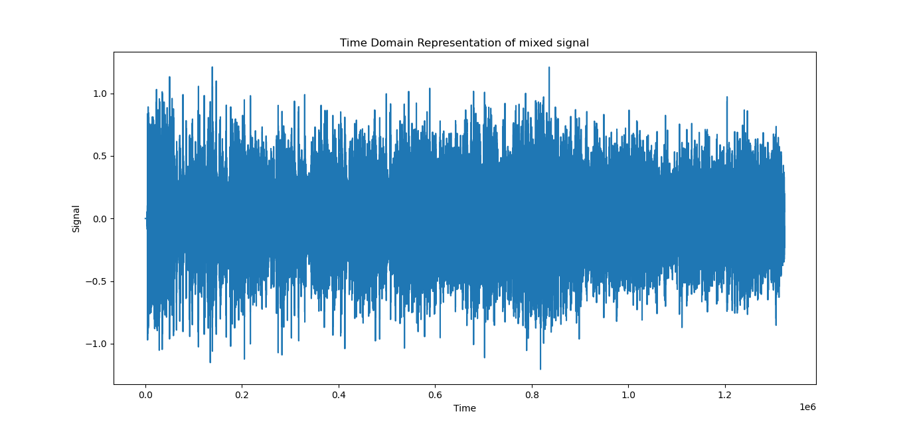
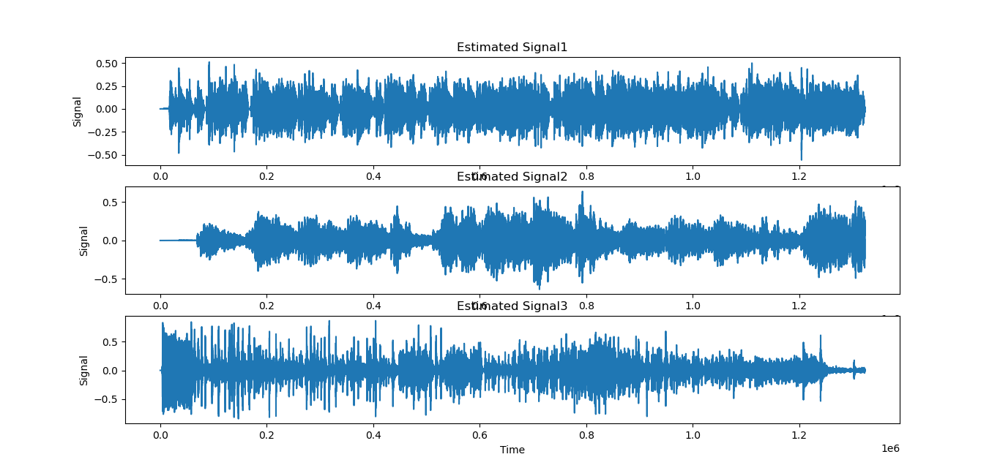

# Introduction
The essence of the cocktail party problem can be formulated as a deceptively simple question: 
 “How do we recognize what one person is saying when others are speaking at the same time?”. 
  independent component analysis **(ICA)** is a computational method for separating a multivariate signal 
  into additive subcomponents and it can be a very efficient tool to solve the cocktail party problem.
  
# Steps
- The user will be asked to load an audio file of mixed voices.

- Implement the fastICA library on the audio file to extract its independent components.

- export each component by the name of "component1, component2, component3... etc" as wav files.

- plot time domain representation of mixed signal as well as each of the separated components

# Samples
I used two samples to test the algorithm, the first one is an instrument mixture and the other one is a vocals mixture.

### 1. Sample 1

#### mixture plot

#### Separated signals plot

### 2. Sample 2

#### mixture plot

#### Separated signals plot

